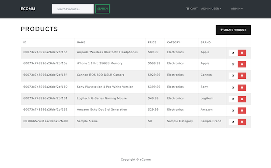

# eComm

**eComm** is a fullstack eCommerce application that utilizes React, Redux, Express, and MongoDB.

eComm includes functionality to display available products, search products, add items to a cart, and complete payment through PayPal. eComm also includes Admin functionality through private admin routes for viewing and editing users, products, and orders.

[Deployed Site](https://ecommapp42.herokuapp.com/)

## Table of Contents

- [Installation](#installation)
- [Usage](#usage)
- [Credits](#credits)
- [Technologies](#technologies)
- [Badges](#badges)

## Installation

To run the application locally in development mode:

- Clone the repository locally
- Add a `.env` file to the root directory that contains:
  - NODE_ENV = production
  - PORT = __*desired port*__
  - MONGO_URI = __*your personal mongo uri*__
  - JWT_SECRET = __*custom secret*__
  - PAYPAL_CLIENT_ID = __*your personal paypal client id*__
- Run the below commant in the root directory to install all required dependencies for the back-end

```
npm install
```

- cd into the `frontend` directory and run the below command to install all required dependencies for the front-end

```
npm install
```

- cd back into the root directory and run the below command to start the express server and run the react app in the front end

```
npm run dev
```

## Usage

Home Page


Admin - Users List


Admin - Products List



Admin - Orders List


Payment Screen


```md

```

hosted images

```md

```

## Credits

This application was constructed using a `Udemy` online tutorial course by `Brad Traversy`

https://www.udemy.com/share/103Cb6CUEZeFtRQXg=/

## Technologies

Back-end
- Express
- MongoDB
- JSON Web Token
- Mongoose
- bcryptjs
- dotenv
- morgan
- multer

Front-end
- React
- Redux
- React-Bootstrap
- Axios

## Badges


